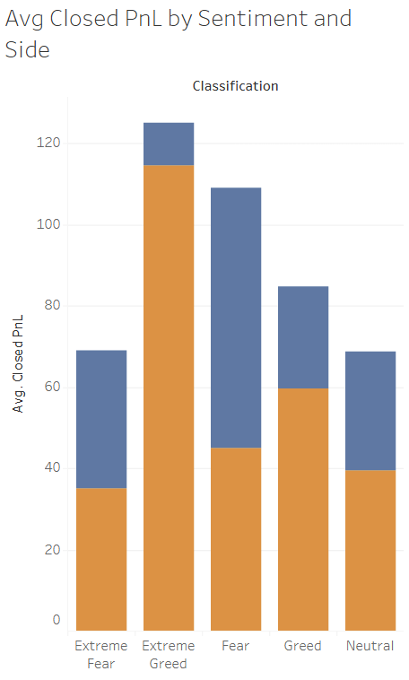
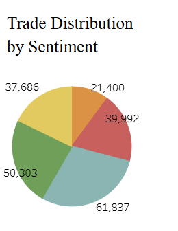

# Trader Performance vs Market Sentiment Analysis

This project explores how trader performance varies under different Bitcoin market sentiment conditions (Fear, Greed, etc.), using real trading data from Hyperliquid and daily sentiment data from the Bitcoin Fear & Greed Index.

## Objective

To uncover whether trader profitability is influenced by market sentiment, and deliver data-driven strategies for more effective trading decisions.

## Datasets Used

1. Bitcoin Market Sentiment Dataset 
   - Columns: `date`, `value`, `classification` (e.g., Fear, Greed)

2. Hyperliquid Historical Trader Data  
   - Columns: `Account`, `Coin`, `Execution Price`, `Side`, `Closed PnL`, `Timestamp IST`, and others

---

## Tools & Technologies

- **Python** (Pandas, Seaborn, Matplotlib)
- **Tableau** (Dashboard creation)
- **Excel** (Export and prep for visualization)

## Key Insights

| Sentiment        | Best Trade Type | Average Profit Trend       |
|------------------|-----------------|-----------------------------|
| Extreme Greed    | SELL            | Highest profits observed    |
| Fear / Greed     | BUY             | Consistent gains            |
| Extreme Fear     | SELL            | Shorting performed better   |
| Neutral          | Neither         | Flat, low-profit conditions |

Insight 1 - BUY trades during Fear & Greed sentiment generated more stable returns  
Insight 2 - SELL trades during Extreme Greed and Extreme Fear had higher payoffs  
Insight 3 - Neutral sentiment days were least profitable overall

## Insights to Strategies

1. From Insight 1- the strategy can be:
   Buy opportunities arise when sentiment is fearful but not extreme. Traders can take long positions with confidence in moderate fear phases.

2. From Insight 2 - the strategy:
   Consider shorting or taking profits when sentiment is extremely greedy. Market may be overheated and due foe a correction.

3. From Insight 3 - the strategy is:
   Avoid aggressive trades during Nuetral sentiment periods. Consider staying flat or using smaller size until a clear market direction forms.

## Tableau Dashboard

The interactive dashboard visualizes:
- Average Closed PnL by Sentiment and Trade Side
- Trade distribution by sentiment
- Filters for Coin, Side, and Sentiment

 

## Folder Contents

- `trader_sentiment_analysis.ipynb`: Full analysis in Python  
- `Trader_Sentiment_Dashboard.xlsx`: Cleaned dataset for Tableau  
- `images/`: Visuals for the dashboard 
- `README.md`: Project summary

## Conclusion

This analysis helps traders and analysts identify when and how sentiment affects trading behavior and profitability. Such insights can guide better timing, position sizing, and strategy alignment based on crowd psychology.
